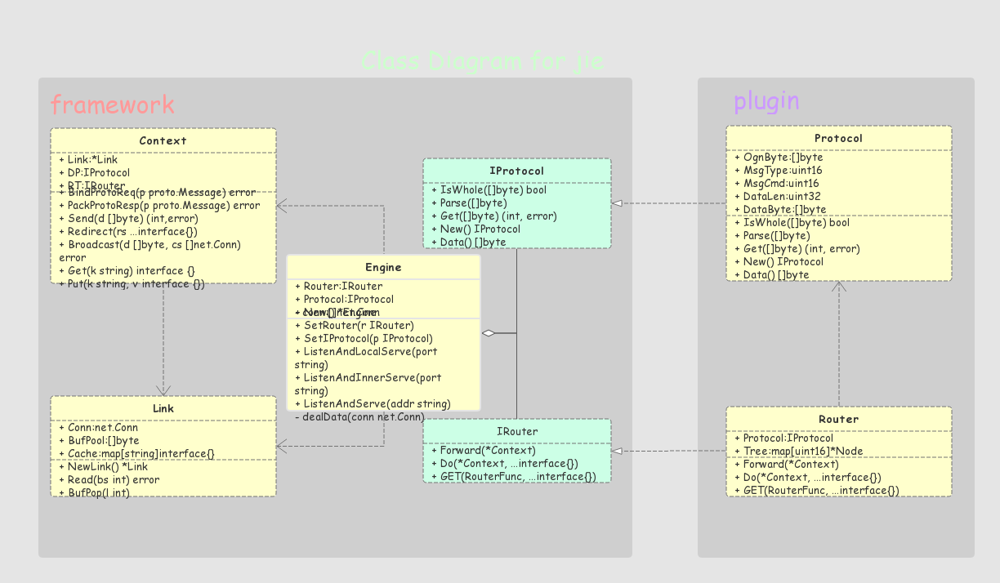

# 通用传输协议框架

寒蝉鸣泣之时：解


## 简介
基于TCP的通信传输框架，可自定义协议，自定义路由，啥都能自定义(才怪)。。。

## 设计理念
本着极简的设计原则，结合通用、易上手的需求特点，理念如下：
* 主引擎只调度接口，不管是哪种实现
* 具体实现由插件提供，插件要保证实现了主引擎所需的接口方法

## 类图


## 使用

```go
package main

import (
	"github.com/Justyer/jie"
	protocol "github.com/Justyer/jie/protocol/ptl_2_2_4"
)

func main() {
	j := jie.New()

	// 设置协议
	j.SetProtocol(protocol.NewProtocol())

	// 设置路由
	j.SetRouter(protocol.NewRouter())

	// 添加路由
	j.Router.GET(func(c *jie.Context) {
		c.Send([]byte("JekoWorld~"))
	}, uint16(1), uint16(2))

	// 开启内网监听
	j.ListenAndInnerServe("9595")
}
```